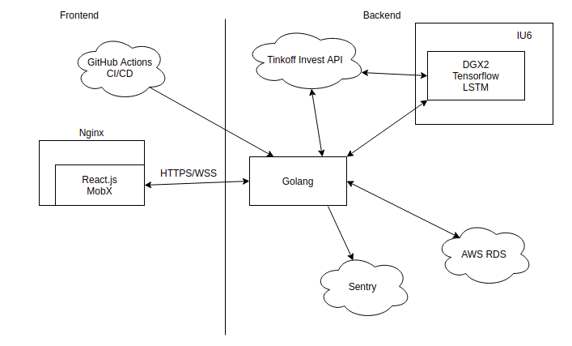

# Backend for Tinkoff investing app  
Фронт nginx  
CI/CD github action  
Deploy Dockerhub, docker-compose  
Back Golang Echo Tests Linter  
Microservices Python ML     
Database PostgreSQL  

Application block diagram  
